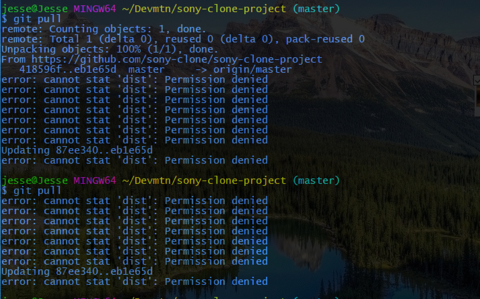

# Error: cannot stat <filename>: Permission denied

From what I've seen this error shows up after attempting `git pull`

### On windows machines, there is an occasional error that looks like this:

Usually what I've found that fixes this is to start closing anything that has those files open.
1. Start with closing the text editor
2. Run `git pull` again
3. If error persists, close other programs, like other instances of bash, or file explorer, etc. (If you';re trying to be scientific about it, close each thing one by one, and run `git pull` in between to narrow down exactly what it is)
4. There is also a possibility that its an issue with their firewall. If none of this works, try changing settings in their firewall to allow downloading files from the internets
5. If you're unsure about this (me too)

### RESOURCES

[stackoverflow: cannot stat upon git pull](https://stackoverflow.com/questions/37152845/error-cannot-stat-upon-git-pull)
[stackoverflow: git rebase: "error: cannot stat 'file': Permission denied"](https://stackoverflow.com/questions/5970879/git-rebase-error-cannot-stat-file-permission-denied)